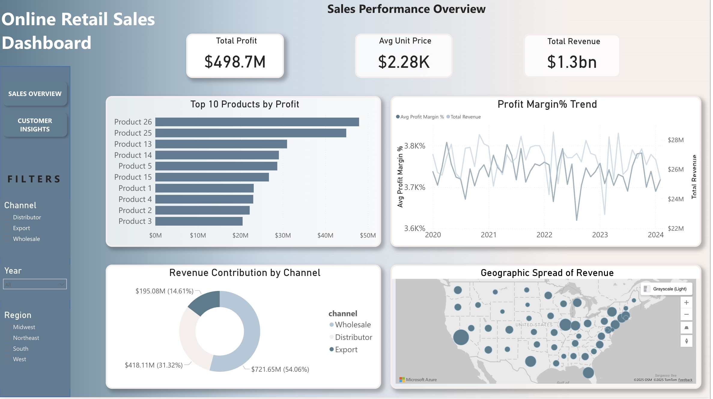
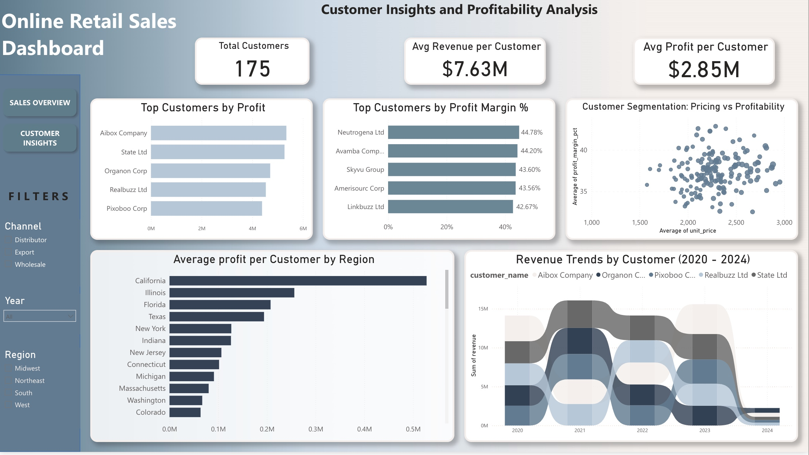

# 📊 Online Retail Sales Dashboard

A modern, insight-driven **Power BI dashboard** analyzing multi-year online retail sales performance. This project transforms a public retail dataset through light data preparation in Python and deeper modeling inside Power BI to reveal trends in revenue, profitability, customer behavior, and regional performance.

Every dataset hides a story — this dashboard aims to uncover *who drives profit, which channels matter, and how regions influence growth*.

---

## 🚀 Features

### **Core Analytics**

* Multi-year sales insights (2020–2024)
* Revenue, profit, and margin KPIs
* Product-level performance metrics
* Regional sales contribution and benchmarking

### **Customer Insights**

* Top customers by revenue & profit
* High-value customer concentration (Pareto 80/20)
* Customer profitability patterns
* Multi-year customer trends

### **Business Intelligence Capabilities**

* Dynamic filtering (product, region, customer)
* Data modeling using Power BI
* Clean, simple visual storytelling designed for decision-makers

---

## 🛠️ Tech Stack

* **Power BI** – Dashboarding, modeling, DAX
* **Power Query** – Transformations
* **Python (Data Preparation Only)** –  Cleaning, joins, feature engineering
* **Pandas / NumPy** – Data manipulation

---

## 📁 Repository Structure

```
Online-Retail-Sales-Dashboard/
├── Online_sales_dashboard.pbix
├── Regional_sales_data_enriched.xlsx
├── Sales_analysis.ipynb
├── images/
│   ├── Page_1.png
│   └── Page_2.png
└── README.md
```

---

## 📄 Dataset

* Source: Public/sample dataset (replace with actual source).
* Performed **light data preparation in Python** (cleaning, merging tables, basic feature engineering).
* Shifted year range from **2017 → 2020–2024** to create a modern analysis window.
* Original dataset had **budget only for a single year**; additional yearly budgets were created **inside Power BI** to support multi‑year budget vs actual analysis.
---

## 📊 Dashboard Overview

### **Page 1 – Sales Overview**

* Revenue & profit KPIs
* Product category performance
* State‑wise contribution map
* Margin percentage and trend visuals

### **Page 2 – Customer Insights**

* Top customers by profit & revenue
* Customer concentration (Pareto 80/20)
* Regional profitability
* Multi-year customer behavior trends

---

## 🎯 Key Insights Delivered

* **Wholesale channels contribute over 50% of total revenue**, signaling both strength and dependency.
* **California and Illinois** lead in profitability, setting high performance benchmarks.
* A **small group of high-value customers** drives a majority of profit — highlighting the need for targeted retention strategies.
* Year-over-year trends help identify growth drivers and focus areas.

---

## 🔧 How to Use This Project

1. Open `Online_sales_dashboard.pbix` in Power BI Desktop.
2. Ensure `Regional_sales_data_enriched.xlsx` is in the same directory (if the PBIX references it).
3. Use the filters on the dashboard pages to explore revenue, customers, and regions.
4. Review the Python notebook for a quick look at the data preparation steps.

---

## 📸 Screenshots




---

## 🏆 Business Impact

This dashboard enables teams to:

* Understand revenue and profit drivers
* Identify and focus on high-value customers
* Benchmark regional performance
* Improve annual planning with budget comparisons
* Support data-driven strategic decisions

---

## 📬 Contact

For questions or collaboration, feel free to reach out!
